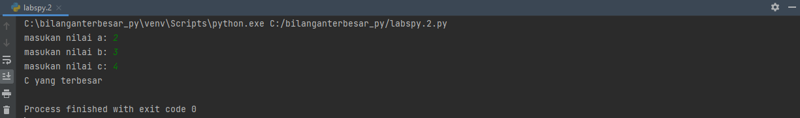

# Praktikum-Labspy02-dan-Labspy03
# labspy02
## Menentukan nilai terbesar dari 3 bilangan

- Berikut ini adalah flowchart untuk menentukan nilai terbesar dari 3 bilangan

### Menggunakan statement if untuk menentukan nilai terbesar dari 3 bilangan

- Disini sudah ada 3 variabel, yaitu a, b, dan c. Kemudian ketiga variabel ini dimasukkan ke input
seperti pada gambar dibawah ini

- Selanjutnya disini ada if untuk a bilangan pertama, elif untuk b bilangan ke 2, dan else untuk c bilangan ke 3. Berikut ini adalah gambar program nya

- Selanjutnya ini adalah hasil output program menentukan nilai terbesar dari 3 bilangan

- Berikut ini adalah tampilan keseluruhan dari program nya

# labspy03
# latihan 1
## Algoritma latihan1 :
Menampilkan n bilangan acak yang lebih kecil dari 0,5, nilai n diisi pada saat runtime.

1.Memasukan/ import fungsi RANDOM terlebih dahulu

2.Deklarasi integer , masukkan jumlah n :

3.Memasukan deskripsi kombinasi for untuk menyelesaikannya.

4.Memasukan nilai jumlah (n) : 5

5.Mencetak data ke 1 sampai 5 dengan hasil nilai kurang dari 0,5.

6.Selesai

### Syntax latihan 1 sebagai berikut :

### Hasil out put latihan 1 sebagai berikut :

# latihan 2 :
## Algoritma latihan 2:
Membuat program untuk menampilkan bilangan terbesar dari n buah data yang diinputkan.Masukkan angka 0 untuk berhenti

1.Mulai

2.Mencetak "latihan 2"

3.Mencetak "menampilkan bilangan, berhenti ketika bilangan 0, menampilkan bilangan terbesar"

4.integer max = 0

5.Menggunakan fungsi perulangan while true, hingga menampilkan perulangan sampai batas tertentu.

6.Memasukan bilangan integer pada "a"

7.Menggunakan fungsi if jika max kurang dari nilai a, maka max sama dengan a

8.Mengunakan fungsi if jika nilai a adalah 0 maka fungsi break artinya perulangan berhenti jika menulis nilai 0.

9.Mencetak nilai paling terbesarv setelah break, sehingga menampilkan nilai terbesar diantara bilangan tersebut dalam perulangan.

10.Selesai

### Syntax latihan 2 sebagai berikut :

### Hasil out put latihan 2 ketika di runtime sebagai berikut :

